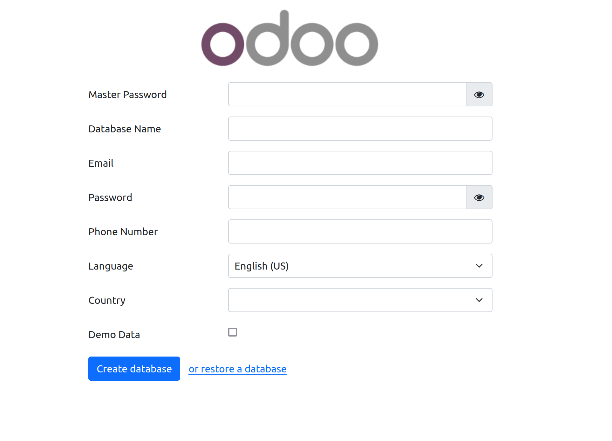
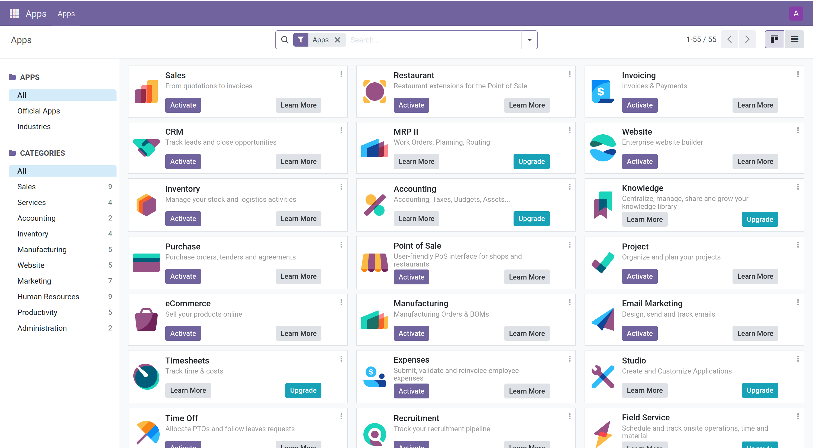

# Set up an Odoo 17 instance using Docker and Docker Compose

This repository contains the configuration to set up an Odoo 17 instance with PostgreSQL using Docker and Docker Compose.

## Prerequisites

- Docker installed on your machine.
- Docker Compose installed on your machine.

## Project Structure

```
.
├── Dockerfile
├── docker-compose.yml
├── customs/
└── odoo.conf
```

- `Dockerfile`: The Dockerfile to build the Odoo web service.
- `docker-compose.yml`: The Docker Compose file to define and run the multi-container Docker application.
- `customs/`: A directory for custom modules and addons.
- `odoo.conf`: The configuration file for Odoo.

## Configuration

### docker-compose.yml

- Defines two services: db (PostgreSQL) and odoo_web (Odoo).
- Specifies ports for each service.
- Defines environment variables for database configuration.
- Mounts volumes for persistent storage.

### odoo.conf

Ensure that your `odoo.conf` file contains the correct database settings

## Setup Instructions

### Clone the Repository

Clone this repository to your local machine using:
```bash
git clone https://github.com/AhmedHoussamBouzine/odoo-17-docker-compose.git
```

### Build the Containers

Build and start the services defined in the `docker-compose.yml` file:

```bash
docker compose up -d
```
This will pull the required images, build the Odoo image from the Dockerfile.

### Start the Containers

```bash
docker compose up
```
### Access Odoo

Open your web browser and go to `http://localhost:8069`. You should see the Odoo setup page.

<p align="center">
  
</p>

### Login and Home Page

After logging in with your credentials, you will be redirected to the Odoo home page, where you can start configuring and using your Odoo instance.

<p align="center">
  
</p>

## Volumes
The docker-compose.yml file defines two volumes for persistent storage:

- `odoo17-web-data`: Stores Odoo's data.
- `odoo17-db-data`: Stores PostgreSQL data.

These volumes ensure that data is not lost when the containers are stopped or removed.

## Custom Modules

Place your custom modules in the `customs/` directory, and ensure that all custom modules have their version fields correctly formatted according to `Odoo 17` requirements.

## Troubleshooting

- If you encounter authentication errors, ensure that the PostgreSQL user and database are correctly set up.
- Verify that the environment variables in the `docker-compose.yml` file match the credentials used in the `odoo.conf` file and PostgreSQL setup.
- Check custom module manifest files for correct version format.